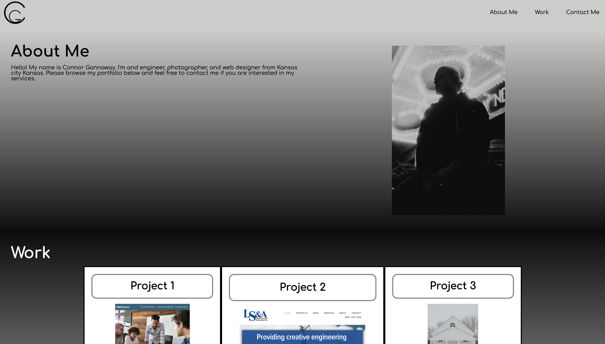

# 01_a11y
# <BTCMP Homework 1>
## Description
The purpose of this assignment is to make our code more semantic and accessible for future users. This will help with optimization for search engines.
This assignment helped me understand the html and CSS languages.
I provided the following by editing the CSS and HTML code:

GIVEN a webpage meets accessibility standards
* WHEN I view the source code
    * THEN I find semantic HTML elements
* WHEN I view the structure of the HTML elements
    * THEN I find that the elements follow a logical structure independent of styling and positioning
* WHEN I view the image elements
    * THEN I find accessible alt attributes
* WHEN I view the heading attributes
   * THEN they fall in sequential order
* WHEN I view the title element
    * THEN I find a concise, descriptive title

## Installation
You may download the index.html and styles sheet from the repository.
## Assets
Below is a screenshot of the home page.

 

## Credits
I credit the Bootcamp staff for providing the boilerplate code.
